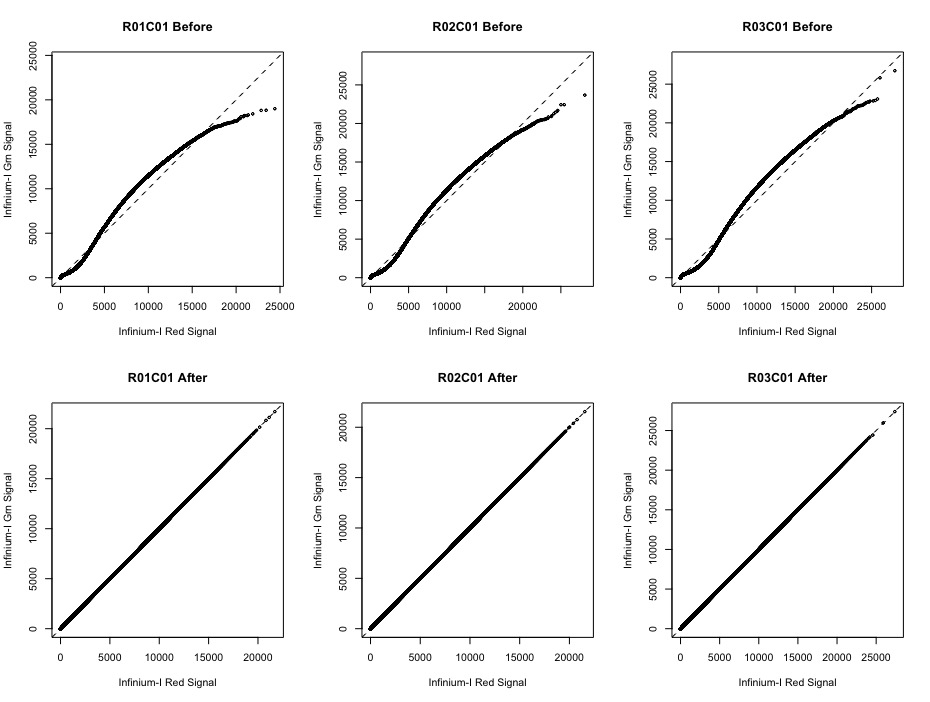
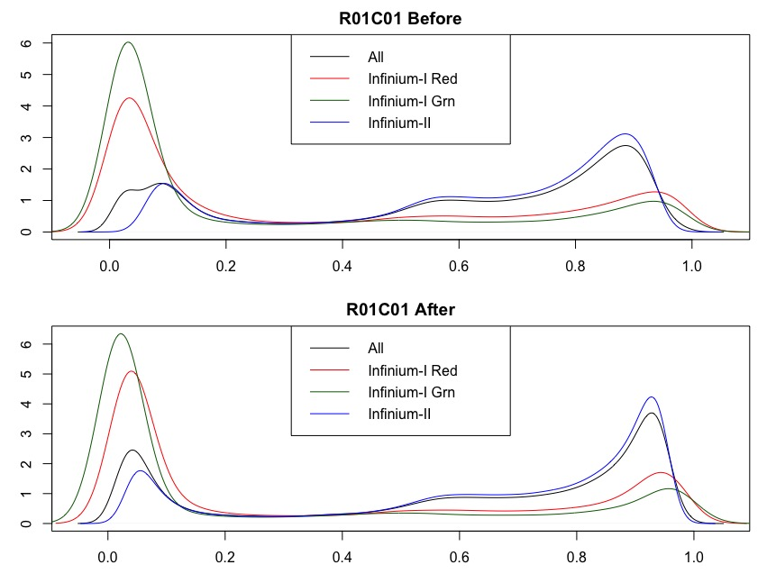
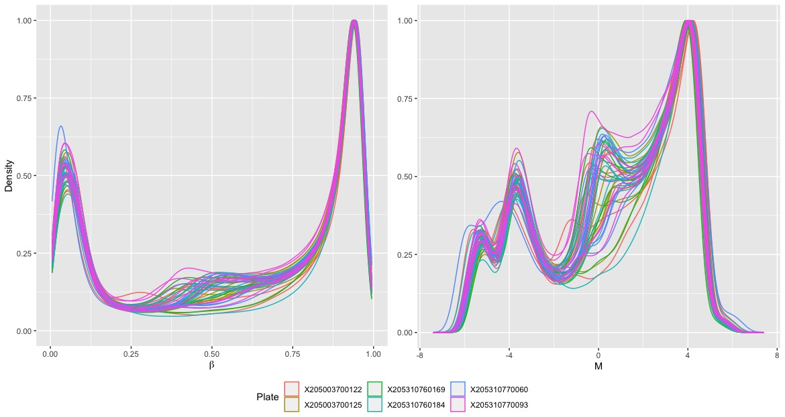

```{r, echo=FALSE, out.width='70%', fig.show='hold'}
logo <- system.file("figures", "sph_cida_wm_blk.png", package="CIDAtools")
knitr::include_graphics(logo)
```

------------------------------------------------------------------------

```{r setup, include=FALSE}
knitr::opts_chunk$set(echo = FALSE)
library(tidyverse)
library(knitr)
library(kableExtra)
library(sesame)
library(sesameData)
library(Biobase)
library(here)
library(readxl)
library(ggpubr)

format_num <- function(number, digits = 0, format = "f") {
  formatC(number, digits = digits, format = format, big.mark = ",")
}
```

# Introduction

The purpose of this report is to document quality-control and data transformation procedures followed to obtain methylation values ($\beta$ and M) for the adolescent vaping study. Much of the code for this report had already been produced by the previous analyst, Cuining Liu. Further steps were taken to dissect the data-pipeline and to support any decisions made moving forward.

# Methods

Methylation samples were taken using the 850K 'EPIC' array. All quality control steps were conducted using the package `SeSAMe` ver. `r package.version("sesame")`. The steps below are not necessarily presented in chronological order which they were taken. The order of pre-processing steps follows the `openSesame` data pipeline available [here](https://www.bioconductor.org/packages/release/bioc/vignettes/sesame/inst/doc/sesame.html#Preprocessing_Function_Code) [@zhou2018].

## Sample Removal

Samples will be evaluated for a low mean-intensity to identify potential outliers with low-quality methylation values. Outliers will be defined by samples in the bottom 1%.

## Probe Masking

The `SeSAMe` package uses probe 'masking' instead of probe removal. These terms are essentially interchangeable; however, it should be noted that 'masked' probes are not actually removed from the dataset. They are only ignored by `SeSAMe` when completing down-stream analyses. Probes are masked in two ways:

1.  [Experiment-independent Probe Masking]{.underline}: Probes that are masked due to non-unique mapping or influence by SNPs.
2.  [Experiment-dependent Probe Masking]{.underline}: Probes that are masked based on the detection p-value, which represents the probability of a detection signal being background flourescence. Masks are based on the detection p-value, which represents the probability of a detection signal being background fluorescence [@zhou2018].

Experiment-independent probe masking is set by a pre-determined list of probes specific to the 'EPIC' array. Experiment -dependent probe masking will be determined by p-value threshold. CpG probes with a detection p-value \> 0.05 will be masked for the purpose of this study.

## Data Transformations

There are two data transformations within the `openSesame` pipeline. The first is a dye bias correction. The `openSesame` pipeline defaults to a non-linear correction which ensures that Infinium-I Red and Grn probes have the same distribution of signal.

The next transformation within the `openSesame` pipeline is background subtraction. The default method is based normal-exponential deconvolution using out-of-band probes [@triche2013]. This transformation is accomplished using the function `noob` and separates true signal from background noise. Eliminating background noise helps to align beta values from Infinium I and II probes and achieve the expected bimodal distribution for each.

This report will provide visualizations for both dye-bias correction and background subtraction to ensure the expected outcome.

## Beta and M-Value Distributions

The product of the `SeSAMe` data pipeline is a matrix of beta values for each sample. Beta values will be converted to M-values using the logit transformation

$$M = log_2(\frac{\beta}{1 - \beta})$$

Visualizations will ensure the proper distribution of $\beta$ and m-values, respectively.

## Sample Clustering

Visualizations of clustering by sex, recruitment center, and batch will help to detect any technical effects that need to be accounted for in downstream analyses.

# Results

```{r echo=FALSE, message=FALSE, warning=FALSE}
betas <- read_tsv(here("DataProcessed/methylation/methylation_betas.txt"))

betas <- drop_na(betas)

methylation_qc <- read_csv(here("DataProcessed/methylation/methylation_qc_metrics.csv"))

probes_removed <- as.numeric(methylation_qc$num_probes_all[1] - dim(betas)[1])

badid <- methylation_qc[methylation_qc$outlier==T,]

badid_label <- paste0("Sample ",as.character(methylation_qc$Sample_ID[methylation_qc$outlier==T]))
```

## Outlier Samples

`r as.character(badid_label)` falls in the bottom 1% of mean signal intensity readings. The boxplot below visualizes this relationship.

```{r}
methylation_qc %>% 
  ggplot(aes(y = log2(mean_intensity))) +
  geom_boxplot() +
  geom_text(data = badid, aes(y = log2(mean_intensity), x = -0.06, label = badid_label), col = "red")+
  geom_hline(aes(yintercept = log2(quantile(methylation_qc$mean_intensity, probs = 0.01)), col = "1st Percentile"), linetype = "dashed") +
  theme(axis.title.x=element_blank(),
        axis.text.x=element_blank(),
        axis.ticks.x=element_blank(),
        legend.position = "bottom") +
  scale_color_manual(values = c("red")) +
  labs(y = "log2(Mean Intensity)",
       color = NULL)
```

Considering the small sample size in this experiment, it is advisable *not* to remove `r badid_label`, but it is worth noting for downstream analyses.

## Probe Masking

After expriment-independent and experiment-dependent (p-value detection) masking, there were `r format_num(dim(betas)[1])` CpG sites remaining for analysis. `r format_num(probes_removed)` were removed due to non-unique mapping, influence by SNPs, and high (\> 0.05) detection p-values.

## Data Transformations

There are several options within the `SeSAMe` package to perform dye-bias correction. The default, `dyeBiasNL`, accounts for the non-linear dependence of signal intensities in type I probes.

### Figure 1: Dye Bias Correction



Figure 1 demonstrates that the non-linear dye-bias correction worked as expected for three of the samples. Similar results are expected for the remaining samples.

### Figure 2: Sample Beta Value Distribution for Infinium I and II Probes



Figure 2 shows the expected outcome of background noise subtraction. Beta values for the given sample are shifted and have similar modes near 0 and 1.

## Beta and M-Value Distributions

Overall, $\beta$ and M-values followed their expected distributions.

### Figure 3



Figure 3 indicates some noise around $\beta$ = 0.5 or $M = 0$. This noise could indicate probes that were not removed by experiment-dependent probe masking. Noise may be reduced at a more stringent threshold for detection p-values (e.g. \< 0.01).

## Clustering by Sex

Visualization of the samples by median X and Y chromosome intensities helps to identify samples with poor quality or samples whose clinical sex do not match predicted sex based on these values. Figure 4 displays plots of median intensity for X and Y chromosomes color-coded for both clinical and predicted sex.

### Figure 4

```{r fig.height= 5, fig.width=10, message=F, error=F, warning=F}
metadata_sex <- read_csv(here("DataProcessed/methylation/metadata_all_sex_2022_08_22.csv"))

#Clinical Sex
clin_sex_plot <- metadata_sex %>% 
  ggplot(aes(x = log2(medianX), y = log2(medianY), col = sex_lab)) +
  geom_text(aes(label = new_id)) +
  labs(col = "Sex",
       title = "Clinical",
       x = "Log2(Median X Intensity)",
       y = "Log2(Median Y Intensity)") +
  theme(legend.position = "bottom") +
  scale_color_manual(values = c("deepskyblue", "deeppink3"))

#Predicted Sex
predicted_sex_plot <- metadata_sex %>% 
  ggplot(aes(x = log2(medianX), y = log2(medianY), col = pred_sex)) +
  geom_text(aes(label = new_id)) +
  labs(col = "Sex",
       title = "Predicted",
       x = "Log2(Median X Intensity)",
       y = "Log2(Median Y Intensity)") +
  theme(legend.position = "bottom")+
  scale_color_manual(values = c("deepskyblue", "deeppink3"))

ggarrange(clin_sex_plot, predicted_sex_plot, nrow = 1, ncol = 2, common.legend = T)

```

Figure 4 demonstrates sample clustering by sex for median X and Y intensities. Clinical sex matches predicted sex for all samples. It should be noted that Sample 16 recorded 'non-binary' as clinical sex, and sex was inferred by methylation data for other portions of this project.

## Clustering by Batch

## Clustering by Recruitment Center

# Conclusions
Overall, $\beta$- and M-values follow their expected distributions. A more stringent cutoff for detection p-value (e.g. <0.01) may help to decrease noise. Sample 17 falls in the 1st percentile for mean signal intensity and should be noted for future analyses. Visualizations are still needed to assess sample clustering due to technical effects, sex, and recruitment center. 

# References
::: {#refs}
:::
<!-- footer -->

------------------------------------------------------------------------

```{r, echo=FALSE, out.width='70%', fig.show='hold'}
knitr::include_graphics(logo)
```
