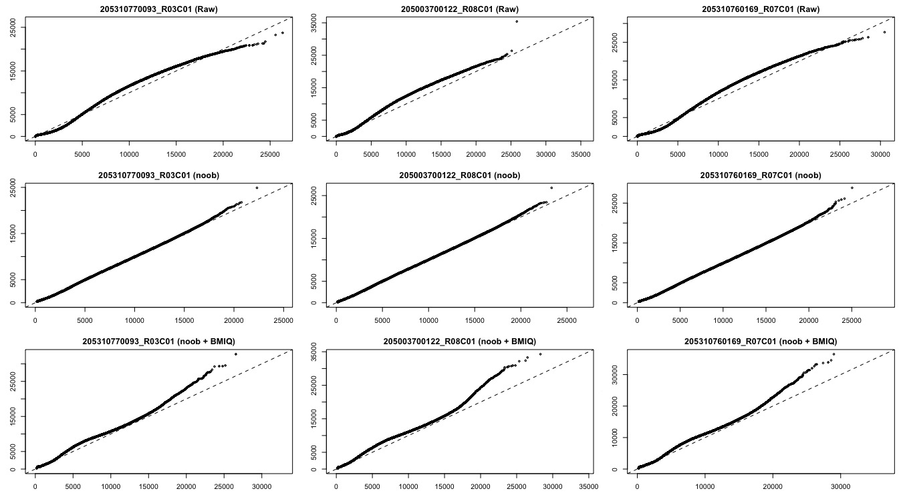
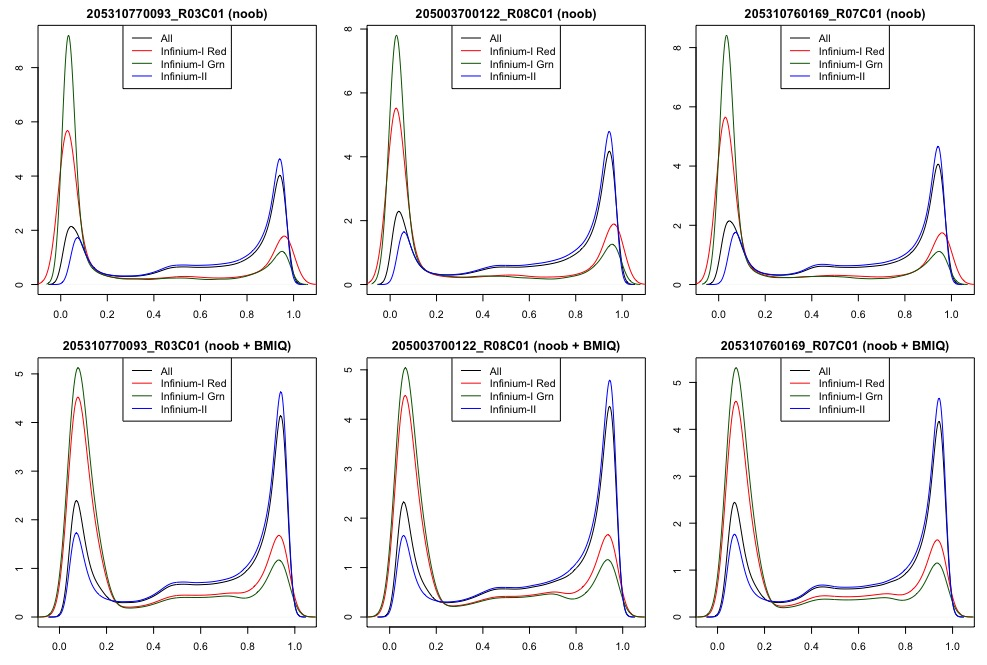
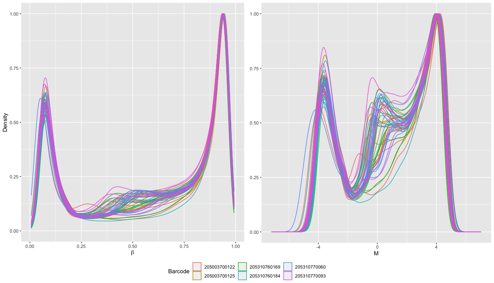

```{r, echo=FALSE, out.width='70%', fig.show='hold'}
logo <- system.file("figures", "sph_cida_wm_blk.png", package="CIDAtools")
knitr::include_graphics(logo)
```

------------------------------------------------------------------------

```{r setup, include=FALSE}
knitr::opts_chunk$set(echo = T)
library(tidyverse)
library(knitr)
library(kableExtra)
library(sesame)
library(sesameData)
library(Biobase)
library(here)
library(readxl)
library(ggpubr)
library(minfi)
library(RColorBrewer)

format_num <- function(number, digits = 0, format = "f") {
  formatC(number, digits = digits, format = format, big.mark = ",")
}

kablize <- function(tab, digits = 3) {
  kable(tab,digits = digits, booktabs = T) %>% 
    kableExtra::kable_styling(latex_options = c("scale_down", "striped"), position = "center")
}
```

# Introduction

The purpose of this report is to document quality-control and data transformation procedures followed to obtain methylation values ($\beta$ and M) for the adolescent vaping study. Much of the code for this report had already been produced by the previous analyst, Cuining Liu. Further steps were taken to dissect the data-pipeline and to support any decisions made moving forward.

**Update 09/09/2022**

The previous version of this report ("Methylation_QC_2022_09_08.html") saw no clustering by vape status, the feature of interest for this study. One concern was the absence of within-array normalization. To address this concern, a 'BMIQ' normalization was performed in addition to the steps previously presented. 'noob' + 'BMIQ' has shown to be a reasonable procedure to improve signal sensitivity previously [@liu2016].

# Methods

Methylation samples were taken using the 850K 'EPIC' array. All quality control steps were conducted using the package `SeSAMe` ver. `r package.version("sesame")`. The steps below are not necessarily presented in chronological order which they were taken. The order of pre-processing steps follows the `openSesame` data pipeline available [here](https://www.bioconductor.org/packages/release/bioc/vignettes/sesame/inst/doc/sesame.html#Preprocessing_Function_Code) [@zhou2018].

## Sample Removal

Samples will be evaluated for a low mean-intensity to identify potential outliers with low-quality methylation values. Outliers will be defined by samples in the bottom 1%.

## Probe Removal

Probes can be removed from the data set in two ways:

1.  [Experiment-independent Probe Masking]{.underline}: Probes that are masked due to non-unique mapping or influence by SNPs.
2.  [Experiment-dependent Probe Masking]{.underline}: Probes that are masked based on the detection p-value, which represents the probability of a detection signal being background flourescence. Masks are based on the detection p-value, which represents the probability of a detection signal being background fluorescence [@zhou2018].

Experiment-independent probe masking is set by a pre-determined list of probes specific to the 'EPIC' array. Experiment -dependent probe masking will be determined by a p-value threshold. CpG probes with a detection p-value \> 0.05 in at least 10% of samples will be masked for the purpose of this study.

## Data Transformations

There are several data transformations within the `sesame` pipeline. The first is a dye bias correction. Dye bias refers to bias in the methylation values due to the performance of the red and green dyes that create flourescence and are then interpreted as methylation values. There are several corrections that can be applied to make the red and green values more comparable. `sesame` specifically implements a non-linear dye bias correction.

The next transformation within the `openSesame` pipeline is background subtraction. The purpose of background subtraction is to align the distribution of beta values for Infinium I and II probes in order to make them more comparable. The default method for `sesame` is a normal-exponential deconvolution using out-of-band probes or 'noob' [@triche2013].

Earlier versions of this report did **not** include BMIQ normalization, but this report will to address the concern for insufficient within-array normalization. BMIQ works in conjunction with noob to correct type II probe bias [@liu2016].

## Beta and M-Value Distributions

The product of the `SeSAMe` data pipeline is a matrix of beta values. Beta values will be converted to M-values using the logit transformation

$$M = log_2(\frac{\beta}{1 - \beta})$$

Visualizations will ensure the proper distribution of $\beta$ and M-values, respectively.

## RUV

Nasal-epithelieal swabs were used to collect genetif 

## Sample Clustering

Visualizations of clustering by sex, recruitment center, and vape status will help to detect any technical effects that need to be accounted for in downstream analyses. CpG sites chosen for these plots are the top 1000 or 10000 most variable sites.

# Results

```{r echo=FALSE, message=FALSE, warning=FALSE}
#Read in Needed Files
#betas
betas <- read_tsv(here("DataProcessed/methylation/methylation_betas_BMIQ.txt"))

#Mvals
mvals <- read_tsv(here("DataProcessed/methylation/methylation_mvals_BMIQ.txt"))

#Autosomal betas
betas_auto <- read_tsv(here('DataProcessed/methylation/autosomal_betas_BMIQ.txt'))

#clinical metadata with chromosomal intensity values
metadata_sex <- read_csv(here("DataProcessed/methylation/metadata_all_sex_2022_08_30.csv"))

#Illumina QC Metrics
methylation_qc <- read_csv(here("DataProcessed/methylation/methylation_qc_metrics.csv")) %>% 
  left_join(., metadata_sex %>% select(rna_id, methylation_id, sid, sentrix_name, vape_6mo_lab), by = "sentrix_name")

```

```{r}
#Samples with no RNA or Meth
no_rna_meth <- metadata_sex %>% 
  filter(is.na(rna_id) & is.na(methylation_id)) %>% 
  .[,"sid"] %>% as.list()
#Samples with no Meth only
no_meth <- metadata_sex %>% 
  filter(!is.na(rna_id) & is.na(methylation_id)) %>% 
  .[,"sid"] %>% as.character()
#Sample without vape status
no_vape_sid <- metadata_sex %>% 
  filter(is.na(vape_6mo_lab)) %>% 
  .[,"sid"] %>% as.character()
#Sample without vape statu
no_vape_sentrix <- metadata_sex %>% 
  filter(is.na(vape_6mo_lab)) %>% 
  .[,"sentrix_name"] %>% as.character()

#Fix betas and mvals
betas <- betas[,colnames(betas) != no_vape_sentrix]
mvals <- mvals[,colnames(mvals) != no_vape_sentrix]
betas_auto <- betas_auto[,colnames(betas_auto) != no_vape_sentrix]

#Label column for plots 
metadata_sex <- metadata_sex %>% 
  mutate(vape_text = if_else(vape_6mo_lab == "Vaped in Last 6 Months", "Vaped", "Not Vaped"))
```

Of the 51 subjects surveyed for this project, methylation data were collected for 48. Two of the three subjects (SID `r no_rna_meth[[1]][1]` & `r no_rna_meth[[1]][2]`) for whom there was no transcript data also had no methylation data. One sample (SID `r no_meth`) included in the RNASeq Analysis known as "Sample 12" also had missing methylation data. This sample was the center of a sensitivity analysis for inclusion in RNASeq analyse (see "sample12_sensitivity_report_2022_mm_dd.html"), and it should be noted that this subject will not be available for comparison. One sample (SID `r no_vape_sid`) lacked vape status in clinical metadata and was removed after obtaining beta values for all subjects in order to retain the benefits of that sample for normalization purposes. This sample was also excluded from the RNASeq analysis. Downstream analyses will include 47 samples.

```{r}
#Get all samples missing data
no_dat_samps <- metadata_sex %>% 
  filter(is.na(rna_id) | is.na(methylation_id)) %>% 
  select(sid, rna_id, methylation_id) %>% 
  rename(rna_id = "RNASeq ID",
         methylation_id = "Methylation ID",
         sid = "Subject ID")
#set option
options(knitr.kable.na = 'No Data')
#make kable table
no_dat_samps %>%
  mutate(`RNASeq ID` = if_else(is.na(`RNASeq ID`), "No Data", `RNASeq ID`),
         `Methylation ID` = if_else(is.na(`Methylation ID`), "No Data", `Methylation ID`))%>% 
  kablize()

#Filter out necessary samples from metadata
metadata_sex <- metadata_sex %>% 
  filter(!is.na(rna_id) , !is.na(methylation_id), !is.na(vape_6mo_lab))
```

## Outlier Samples

```{r}
low_qual_id <- as.character(methylation_qc[methylation_qc$outlier == T, "sid"])
```

`r low_qual_id` falls in the bottom 1% of mean signal intensity readings.

### Figure 1: Sample Quality Outliers

```{r fig.height=2, fig.width=4}

## Plot Outliers ##
methylation_qc %>% 
  ggplot(aes(y = log2(mean_intensity))) +
  geom_boxplot() +
  geom_text(data = methylation_qc[methylation_qc$outlier == T, ], aes(y = log2(mean_intensity), x = -0.03, label = methylation_qc[methylation_qc$outlier == T, ]$sid), col = "red")+
  geom_hline(aes(yintercept = log2(quantile(methylation_qc$mean_intensity, probs = 0.01)), col = "1st Percentile"), linetype = "dashed") +
  theme(axis.title.x=element_blank(),
        axis.text.x=element_blank(),
        axis.ticks.x=element_blank(),
        legend.position = "bottom") +
  scale_color_manual(values = c("red")) +
  labs(y = "log2(Mean Intensity)",
       color = NULL)
```

Considering the small sample size in this experiment, it is advisable *not* to remove `r low_qual_id`, but it is worth noting for downstream analyses.

## Probe Masking

```{r}
#non-experimental probes removed
raw_idat_example <- readIDATpair(here("DataRaw/methylation/RawIdat/Slide_1_205310770060/205310770060_R01C01"))

non_exp_probes_rm <- qualityMask(raw_idat_example)$mask %>%
  sum() %>% as.numeric()

#experimental probes removed
exp_probes_rm <- as.numeric(length(raw_idat_example$Probe_ID)) - dim(betas)[1] - non_exp_probes_rm #total probes - probes kept - nonexp probes removed

#total probes removed
total_probe_rm <- non_exp_probes_rm + exp_probes_rm
```

`r format_num(non_exp_probes_rm)` CpG sites were removed by non-experimental probe masking and `r format_num(exp_probes_rm)` were removed by experimental probe masking (detection p-value \> 0.05 in $\ge$ 10% of samples). `r format_num(total_probe_rm)` probes were removed in total. `r dim(betas)[1]` were included for the anlyses presented in this report. 

## Data Transformations

Figure 2 demonstrates the non-linear dye bias correction in conjunction with 'noob' followed by noob + BMIQ for a random subset of samples.

### Figure 2: Dye Bias Correction



The inclusion of a dye-bias correction and noob shows improvement over the raw data, but there is still a slight bias towards green which would correspond to unmethylated probes. These plots suggest the the inclusing of the "noob + bmiq" normalization method induces additional bias towards green probes and is visually more biased than the raw data.   

Table 2 attempts to quantify the performance for each of the plots presented above. Each value represents the proportion of values that were below the average distance away from the 'x = y' line in the Q-Q Plots. Values closer to 1 are desirable. 

### Table 2: Q-Q Plot Performance
```{r message=FALSE, echo=TRUE}
dye_bias_eval <- read_csv(here("DataProcessed/methylation/dye_bias_quality_check.csv")) %>% as.data.frame()

rownames(dye_bias_eval) <- c("Raw", "Noob", "Noob + BMIQ")

dye_bias_eval %>% kablize(digits = 2)
```

Table 2 shows that dye bias improves with noob normalization, but actually has *more* bias after BMIQ normalization in the three cases presented. 

Figure 3 demonstrates a combination of the 'noob' and 'BMIQ' method of background subtraction for three randomly selected samples.

### Figure 3: Sample Beta Value Distribution for Infinium I and II Probes



'noob' background subtraction in conjunction with 'BMIQ' normalization shifted the distributions of probes to have modes closer to 0 and 1 (the expected distribution of beta values). Additionally, it appears that some noise was removed from the unmethylated beta values.

## Beta and M-Value Distributions

Overall, $\beta$ and M-values followed their expected distributions with peaks near 0 (unmethylated sites) and 1 (methylated sites) in the beta distribution.

### Figure 4: $\beta$ and M-Value Distributions



Figure 4 indicates some noise around $\beta$ = 0.5 or $M$ = 0. This noise could indicate probes that were not removed by experiment-dependent probe masking. Noise may be reduced at a more stringent threshold for detection p-values (e.g. \< 0.01).

## Clustering by Sex

Visualization of the samples by median X and Y chromosome intensities helps to identify samples with poor quality or samples whose clinical sex do not match predicted sex based on these values. Figure 5 displays plots of median intensity for X and Y chromosomes color-coded for both clinical and predicted sex.

### Figure 5: Sex Verification

```{r fig.height= 5, fig.width=10, message=F, error=F, warning=F}
#Clinical Sex
clin_sex_plot <- metadata_sex %>% 
  ggplot(aes(x = log2(medianX), y = log2(medianY), col = sex_lab)) +
  geom_text(aes(label = sid)) +
  labs(col = "Sex") +
  theme(legend.position = "bottom") +
  scale_color_manual(values = c("deepskyblue", "deeppink3"))

#Predicted Sex
predicted_sex_plot <- metadata_sex %>% 
  ggplot(aes(x = log2(medianX), y = log2(medianY), col = pred_sex)) +
  geom_text(aes(label = sid)) +
  labs(col = "Predicted Sex") +
  theme(legend.position = "bottom")+
  scale_color_manual(values = c("deepskyblue", "deeppink3"))

ggarrange(clin_sex_plot, predicted_sex_plot, nrow = 1, ncol = 2, common.legend = T)
```

Figure 5 demonstrates sample clustering by sex for median X and Y intensities. Clinical sex matches predicted sex for all samples. It should be noted that SID 122 recorded 'non-binary' as clinical sex, and sex was inferred by methylation data for other portions of this project.

## Sample Clustering

```{r}
#convert cpgsites back to rownames
mds_prep <- function(dat) {
  dat <- as.data.frame(dat)
  rownames(dat) <- dat[,"CpG_Site"]
  new_dat <- dat %>% 
    select(-CpG_Site) %>% 
    as.matrix()
  return(new_dat)
}

#Allow MDS to plot more MDS coordinates
mdsPlot_n <- function(dat, numPositions = 1000, sampNames = NULL,
                    sampGroups = NULL, xlim, ylim, pch = 1,
                    pal = brewer.pal(8, "Dark2"), legendPos = "bottomleft",
                    legendNCol, main = NULL, n_mds = 2) {
    # Check inputs
    if (is(dat, "MethylSet") || is(dat, "RGChannelSet")) {
        b <- getBeta(dat)
    } else if (is(dat, "matrix")) {
        b <- dat
    } else {
        stop("dat must be an 'MethylSet', 'RGChannelSet', or 'matrix'.")
    }
    if (is.null(main)) {
        main <- sprintf(
            "Beta MDS\n%d most variable positions",
            numPositions)
    }

    o <- order(rowVars(b), decreasing = TRUE)[seq_len(numPositions)]
    d <- dist(t(b[o, ]))
    fit <- cmdscale(d, k = n_mds)
    if (missing(xlim)) xlim <- range(fit[, n_mds - 1]) * 1.2
    if (missing(ylim)) ylim <- range(fit[, n_mds]) * 1.2
    if (is.null(sampGroups)) sampGroups <- rep(1, numPositions)
    sampGroups <- as.factor(sampGroups)
    col <- pal[sampGroups]
    if (is.null(sampNames)) {
        plot(
            x = fit[, n_mds - 1],
            y = fit[, n_mds],
            col = col,
            pch = pch,
            xlim = xlim,
            ylim = ylim,
            xlab = paste0("MDS ", as.character(n_mds - 1)),
            ylab = paste0("MDS ", as.character(n_mds)),
            main = main)
    } else {
        plot(
            x = 0,
            y = 0,
            type = "n",
            xlim = xlim,
            ylim = ylim,
            xlab = paste0("MDS ", as.character(n_mds - 1)),
            ylab = paste0("MDS ", as.character(n_mds)),
            main = main)
        text(x = fit[, n_mds - 1], y = fit[, n_mds], sampNames, col = col)
    }
    numGroups <- length(levels(sampGroups))
    if (missing(legendNCol)) legendNCol <- numGroups
    if (numGroups > 1) {
        legend(
            x = legendPos,
            legend = levels(sampGroups),
            ncol = legendNCol,
            text.col = pal[seq_len(numGroups)])
    }
}

plotCpg <- function(dat, cpg, pheno, type = c("categorical", "continuous"),
                    measure = c("beta", "M"), ylim = NULL, ylab = NULL,
                    xlab = "", fitLine = TRUE, mainPrefix = NULL,
                    mainSuffix = NULL) {
    if (is.numeric(cpg)) cpg <- rownames(dat)[cpg]
    type <- match.arg(type)
    measure <- match.arg(measure)
    if (is(dat, "MethylSet") || is(dat, "RGChannelSet")) {
        if (measure == "beta") {
            # NOTE: as.matrix() necessary in case 'dat' is a
            #       DelayedArray-backed minfi object
            x <- as.matrix(getBeta(dat[cpg, ]))
            if (is.null(ylab)) ylab <- "Beta"
            if (is.null(ylim)) ylim <- c(0, 1)
        } else if (measure == "M") {
            x <- getM(dat[cpg, ])
            if (is.null(ylab)) ylab <- "M"
            if (is.null(ylim)) ylim <- range(x)
        }
    } else {
        if (is.null(ylab)) ylab <- "unknown"
        x <- dat
        if (is.vector(x)) {
            x <- matrix(x, ncol = 1)
        } else {
            x <- as.matrix(x)
        }
    }
    main <- paste(mainPrefix, cpg, mainSuffix)
    names(main) <- cpg
    for (i in cpg) {
        if (type == "categorical") {
            stripchart(
                x = x[i, ] ~ pheno,
                vertical = TRUE,
                method = "jitter",
                jitter = 0.15,
                ylab = ylab,
                ylim = ylim,
                main = main[i])
        } else if (type == "continuous") {
            plot(
                x = pheno,
                y = x[i,],
                ylab = ylab,
                xlab = xlab,
                ylim = ylim,
                main = main[i])
            if (fitLine) abline(lm(x[i, ] ~ pheno), col = "blue")
        }
    }
}
#Code to prep data and make mds plots
make_mds_plots_n <- function(vals, meta, plot = c("sex", "vape", "center"), nump = 1000, lim = c(-10, 10), mlim = c(-50, 50), n_mds = 2){
  #Get only samples with methylation data and arrange in same order as betas so that you can use for mds plots
  meta <- meta %>% 
    filter(sentrix_name %in% colnames(vals)) %>% 
    arrange(factor(sentrix_name, levels = colnames(vals)))
  
  #Prep values for mds plots
  vals <- mds_prep(vals)
  
  #Get mvals
  mvals <- BetaValueToMValue(vals)
  
  # Set Color Pallattes
  sex_pal <- c("deepskyblue", "deeppink3")
  center_colors <- c("cyan3", "chartreuse3", "darkorange")
  
  
  #MDSPlots (Betas)
  par(mfrow = c(1,2))
  if ("sex" %in% plot) {
  #Clustering by Sex
  mdsPlot_n(vals, sampGroups = meta$sex_lab, sampNames = meta$sid,
          numPositions=nump, ylim = lim, main = paste0("Sex - Betas - ", as.character(nump)), 
          pal = sex_pal,
          n_mds = n_mds)
  
  mdsPlot_n(mvals, sampGroups = meta$sex_lab, sampNames = meta$sid,
          numPositions=nump, ylim = mlim, main = paste0("Sex - M-values - ", as.character(nump)), 
          pal = sex_pal,
          n_mds = n_mds)
  }
  if ("vape" %in% plot) {
  #Clustering by Vape Status
  mdsPlot_n(vals, sampGroups = meta$vape_text, sampNames = meta$sid,
          numPositions=nump, ylim = lim, main = paste0("Vape Status - Betas - ", as.character(nump)),
          n_mds = n_mds)
  
  mdsPlot_n(mvals, sampGroups = meta$vape_text, sampNames = meta$sid,
          numPositions=nump, ylim = mlim, main = paste0("Vape Status - M-values - ", as.character(nump)),
          n_mds = n_mds)
  }
  if ("center" %in% plot) {
  #Clustering by center
  mdsPlot_n(vals, sampGroups = meta$recruitment_center, sampNames = meta$sid,
          numPositions=nump, 
          ylim = lim, 
          pal = center_colors, 
          main = paste0("Recruitment Center - Betas - ", as.character(nump)),
          n_mds = n_mds)
  
  mdsPlot_n(mvals, sampGroups = meta$recruitment_center, sampNames = meta$sid,
          numPositions=nump, ylim = mlim, pal = center_colors, 
          main = paste0("Recruitment Center - M-values - ", as.character(nump)),
          n_mds = n_mds)
  }
}

```

MDS plots were made using the package `minfi` ver. `r package.version("minfi")` using $\beta$ and M-values preprocessed using the `sesame` pipeline. For each feature of interest, plots were made a) using probes from the whole genome and b) using only autosomal probes. Using only autosomal probes removes the inherrent separation by sex to get a better idea of clustering patterns.

### Figure 6: Sample Clustering (Sex)

#### All Chromosomes (Including X and Y)

```{r fig.height=8, fig.width=12}
#Whole Genome
make_mds_plots_n(betas, metadata_sex, plot = "sex", nump = 1000, mlim = c(-20, 20))
make_mds_plots_n(betas, metadata_sex, plot = "sex", nump = 10000, lim = c(-40, 40), mlim = c(-100, 100))
```

#### Autosomes Only

```{r fig.height=8, fig.width=12}
#Autosomal
make_mds_plots_n(betas_auto, metadata_sex, plot = "sex", lim = c(-10, 10), mlim = c(-50, 50))
make_mds_plots_n(betas_auto, metadata_sex, plot = "sex", lim = c(-10, 10), nump = 10000)
```

When retaining the X and Y chromosomes, the samples cluster by sex, as expected. When looking only at the autosomal chromosomes, there is no additional clustering that needs to be accounted for.

### Figure 7: Sample Clustering (Vape Status)
#### All Chromosomes  
```{r fig.height=8, fig.width=12}
make_mds_plots_n(betas, metadata_sex, plot = "vape", nump = 1000)
make_mds_plots_n(betas, metadata_sex, plot = "vape", nump = 10000, lim = c(-10, 10), mlim = c(-100, 100))
```
  
#### Autosomes Only  
```{r fig.height=8, fig.width=12}
#Autosomal
make_mds_plots_n(betas_auto, metadata_sex, plot = "vape", lim = c(-10, 10), mlim = c(-50, 50))
make_mds_plots_n(betas_auto, metadata_sex, plot = "vape", lim = c(-10, 10), nump = 10000)
```

The previous version of this report ("Methylation_QC_2022_09_08.html") saw no clustering by vape status. After the addition of 'BMIQ' normalization, there may be some weak clustering by vape status. It is also worthwhile to check for clustering along further MDS coordinates.

### Figure 8: Vape Status Clustering (MDS 3 & 4)
```{r fig.height=8, fig.width=12}
make_mds_plots_n(betas, metadata_sex, plot = "vape", nump = 1000, lim = c(-5, 5), mlim = c(-15, 15), n_mds = 4)
make_mds_plots_n(betas, metadata_sex, plot = "vape", nump = 10000, lim = c(-5, 5), mlim = c(-15, 15), n_mds = 4)
```

Looking at MDS coordinates 3 and 4 for vape status, there is still no obvious clustering pattern. This may indicate technical effects still present in the data that were not handled well by 'noob + bmiq' normalization, or it could indicate a lack of biological signal. It is hard to say at this stage, but perhaps other normalization procedures are necessary. 


### Figure 8: Sample Clustering (Recruitment Center)

```{r fig.height=8, fig.width=12}
make_mds_plots_n(betas, metadata_sex, plot = "center", nump = 1000)
make_mds_plots_n(betas, metadata_sex, plot = "center", nump = 10000, lim = c(-100, 100), mlim = c(-100, 100))
```

There is no visual clustering by recruitment center. 

# Conclusions

The review of sample quality and clustering patterns returned one subject (SID = `r low_qual_id`) that fell in the 1st percentile for mean intensity. There is also a clear sex effect in the data that will be accounted for by including sex as a model covariate. The inclusion of the "noob + BMIQ" normalization method may have induced some weak clustering by vape status, but also induced noticeable green dye-bias. This bias should be noted for downstream analyses as models may tend to underestimate methylation values for some sites.  

# References

::: {#refs}
:::

<!-- footer -->

------------------------------------------------------------------------

```{r, echo=FALSE, out.width='70%', fig.show='hold'}
knitr::include_graphics(logo)
```
