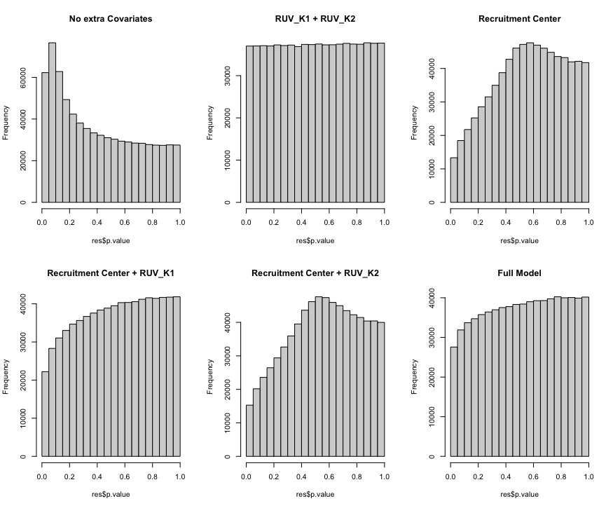

```{r, echo=FALSE, out.width='70%', fig.show='hold'}
logo <- system.file("figures", "sph_cida_wm_blk.png", package="CIDAtools")
knitr::include_graphics(logo)
```

------------------------------------------------------------------------

```{r setup, include=FALSE}
knitr::opts_chunk$set(echo = FALSE)
library(tidyverse)
library(knitr)
library(kableExtra)
library(bacon)
library(here)
```

# Introduction

The purpose of this report is to document the steps taken and the subsequent results for the Differentially Methylated Position (DMP) analysis as part of the Adolescent Vaping study.

# Methods

Up to this point, the data has been normalized using Noob, BMIQ, and RUVm. To find differentially methylated positions (DMPs), a linear model will be fit for each CpG site that remains after pre-processing and corrected using False Discovery Rate (FDR).

The same model as the RUV-Seq Analysis will be fit to maintain comparability for any future integrative analyses. The model will look for changes in M-values due to vape status after adjusting for age, sex, recruitment center and two RUV-factors:

$$M-Value = \beta_0 + \beta_1 * vape \ status + \beta_2 * center + \beta_3* sex + \beta_4 * age + \beta_5 * ruv_{k1} + \beta_6 * ruv_{k2} + \epsilon_i$$

The 'methylation_interim_results_yyyy_mm_dd' report documented problems with model specification. Specifically, issues caused by collinearity between Vape Status, the exposure of interest, and recruitment center. This report will pose two solutions to the model specification issues found in that report. The first solution is to drop recruitment center from the model. The other is to use the method proposed by Iterson, et. al. to control for 'deflated' p-values @vaniterson2017. The analysis will compare results from the two methods and conclude with a decision about which results to refer to moving forward.

# Descriptive Statistics

Before continuing to results, it is important to first re-assess the distribution of demographics in the study. Specifically, there is one study participant (SID: 102, RNA_ID: Sample 12) who had a complete RNA-Seq data who was not included in the methylation array. This subject was a *vaping* *male* from *Pueblo, CO*.

```{r results='asis'}
library(arsenal)
clin_metadata <- read_csv(here("DataProcessed/clinical_metadata/master_clinical_metadata_2022_09_02.csv"), show_col_types = F)

clin_metadata <- clin_metadata %>% 
  filter(!is.na(methylation_id),
         !is.na(vape_6mo_lab))
#create table 1
vape_6mo_table1 <- clin_metadata %>% 
  tableby(vape_6mo_lab ~ sex_lab + age + recruitment_center + 
            latino_lab + fev1 + fev1_fvc + 
            r5 + x20, data = ., digits = 1, test = T)

#Fix Labels
arsenal::labels(vape_6mo_table1) <- c(vape_6mo_lab = "Vaped in last 6 months", 
                             age = "Age (yrs)", sex_lab = "Sex", 
                             recruitment_center = "Recruitment Center", 
                             latino_lab = "Ethnicity", fev1 = 'FEV1',
                             fev1_fvc = "FEV1/FVC (%)", r5 = 'R5', x20 = 'X20')

#Print Tables
summary(vape_6mo_table1, pfootnote = T, title="Table 1: Distribution of demographic variables for the subjects included in the methylation analysis. A test for association with vape status is included for each variable.")
```

Table 1 shows a decrease from N = 12 to N = 11 vapers in comparison with the RNA-Seq analysis. Additionally, *Recruitment Center*, *R5*, and *X20* are are all significantly associated with *Vape Status*. This is consistent with the RNA-Seq analysis.

# Results

The "methylation_interim_results" document the issue of model misspecification. The problem may be summarised by looking at p-value distributions for models which test varying combinations of covariates. All of the models below adjust for vape status, age, and sex. The sub-title of each figure documents the additional covariates added to the model which produced the corresponding p-value distribution.



In summary, it appears that the multicollinearity between recruitment center and and vape status is driving the pattern of deflated p-values seen in the 'Full Model'.

We will report the results from two models which pose solutions to the problem of deflated p-values. The first solution is to exclude recruitment center from the model as seen in Figure 1 (plot 'RUV_K1 + RUV_K2'). The other is to attempt to control for the deflation @vaniterson2017.

## Solution 1: Drop *recruitment center* from the model

This model tests for differential methylation among subjects who have vaped in the last 6 months vs. those who have not after controlling for age, sex, and two RUV factors.

## Solution 2: Use Bacon @vaniterson2017 to control for deflated p-values

This model follows the same framework of the full model outlined in the methods section. After fitting the model however, the methods implemented in the r-package `bacon` use the empirical null distribution to estimate both the bias and inflation of the model test-statistics.

<!-- footer -->

------------------------------------------------------------------------

```{r, echo=FALSE, out.width='70%', fig.show='hold'}
knitr::include_graphics(logo)
```
