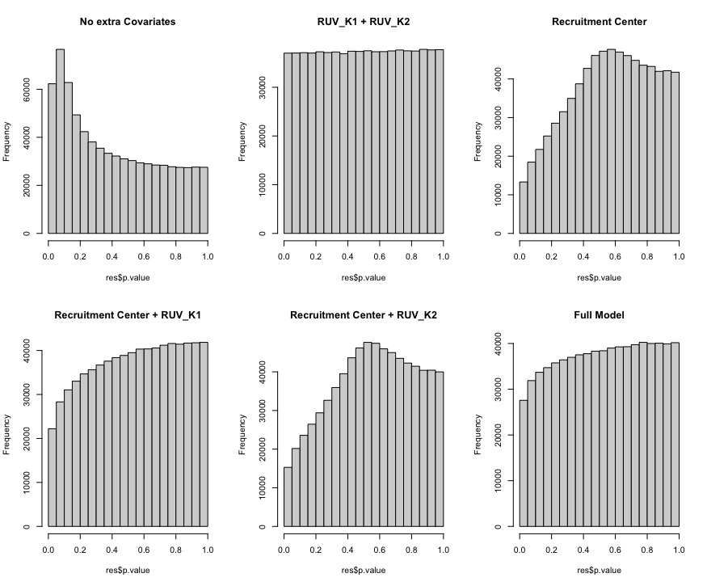

```{r, echo=FALSE, out.width='70%', fig.show='hold'}
logo <- system.file("figures", "sph_cida_wm_blk.png", package="CIDAtools")
knitr::include_graphics(logo)
```

---

```{r setup, include=FALSE}
knitr::opts_chunk$set(echo = FALSE)
library(tidyverse)
library(here)
library(gt)
```

# Introduction

The purpose of this report is to provide interim analysis and interpretation of the methylation data for Sunita Sharma's teen vaping project. We have encountered some interesting features of the model, and want to document our decisions. 

# Methods

Up to this point, the data has been normalized using Noob, BMIQ, and RUVm. To find differentially methylated positions (DMPs), a linear model will be fit for each CpG site that remains after pre-processing and normalization and corrected using false discovery rate (fdr).

The same model as the RUV-Seq Analysis will be fit to maintain comparability for any future integrative analyses. The model will look for changes in M-values due to vape status after adjusting for age, sex, recruitment center and two RUV-factors:

$$M-Value = \beta_0 + \beta_1 * age + \beta_2 * center + \beta_3* sex + \beta_4 * vape \ status + \beta_5 * ruv_{k1} + \beta_6 * ruv_{k2} + \epsilon_i$$

# Results 

Model results returned 0 CpG Sites significant at the $\alpha = 0.05$ level. Only one significant CpG site was found at the $\alpha = 0.2$ level. 

```{r message=F, error=F, warning=F}

kablize <- function(tab, digits = 3, capt) {
  kableExtra::kable(tab,digits = digits, booktabs = T, caption = capt) %>% 
    kableExtra::kable_styling(latex_options = c("scale_down", "striped"), position = "center", )
}

mod_res <- read_csv(here("DataProcessed/methylation/results/results_ruvk1_ruvk2.csv"), show_col_types = F) %>% 
  column_to_rownames("CpG_Site")

mod_res_summary <- data.frame(Model = c("Full Model"), 
           "FDR < 0.05" = sum(mod_res$fdr < 0.05),
           "FDR < 0.1" = sum(mod_res$fdr < 0.1),
           "FDR < 0.2" = sum(mod_res$fdr < 0.2))

colnames(mod_res_summary) <- c("Model", "FDR < 0.05", "FDR < 0.1", "FDR < 0.2")

mod_res_summary %>% kablize(capt = "Model results for varying Type-I Error Rates under False Discovery Rate (FDR)")
```

To further explore the extremely low rate of discoveries, the figure below shows the distribution of p-values for the model results. 

## Figure 1: P-value distribution for the full model
```{r}
mod_res %>% 
  ggplot(aes(x = p.value)) +
  geom_histogram(col = "white", bins = 20)+
  labs(y = "Count",
       x = "p-value")
```

Model results show an unexpected distribution of p-values. This distribution may reflect multicollinearity or confounding in the model. Associations of the included covariates are investigated below

```{r message=F, warning=F, error=F}
# Read in files ---------------------------------------------------------------

clin_metadata <- read.csv(here("DataProcessed/methylation/clin_metadata_w_ruv.csv")) %>% 
  dplyr::rename("ruv_k1" = X1,
                "ruv_k2" = X2) %>% 
  drop_na(vape_6mo_lab, methylation_id) %>% 
  mutate(vape_status = factor(vape_6mo_lab, 
                              levels = c("Did Not Vape in Last 6 Months", "Vaped in Last 6 Months"),
                              labels =  c("Not Vaped", "Vaped")),
         recruitment_center = factor(recruitment_center, 
                                     levels = c("Pueblo", "Aurora", "CommCity/Denver")))

mvals <- read_tsv(here("DataProcessed/methylation/methylation_mvals_final_2022_09_27.txt"), show_col_types = F) %>% 
  column_to_rownames("CpG_Site") 

mvals <- mvals[,colnames(mvals) %in% clin_metadata$sentrix_name]

# Check Correlations ------------------------------------------------------

check_corr<- function(y, x, dat){
  #T.Test for categorical with 2 levels
  if(is.factor(dat[[x]]) & length(levels(dat[[x]])) == 2){
    temp_res <- t.test(dat[[y]] ~ dat[[x]])
    pval <- temp_res$p.value
  }
  
  #One-way AOV for categorical with > 2 levels
  if(is.factor(dat[[x]]) & length(levels(dat[[x]])) > 2){
    temp_res <- summary(aov(dat[[y]] ~ dat[[x]]))
    pval <- as.numeric(temp_res[[1]]$`Pr(>F)`[1])
  }
  
  #Two continuous variables
  if(is.numeric(dat[[x]])){
    temp_res <- cor.test(dat[[x]], dat[[y]])
    pval <- temp_res$p.value
  }
return(pval)  
}

#Variables of interest
vars_of_interest <- c("recruitment_center", "vape_status", "age")
ruv_k1_corr <- sapply(vars_of_interest, function(x) check_corr("ruv_k1", x, dat = clin_metadata))
ruv_k2_corr <- sapply(vars_of_interest, function(x) check_corr("ruv_k2", x, dat = clin_metadata))

cbind(ruv_k1_corr, ruv_k2_corr) %>% 
  as.data.frame() %>% 
  mutate(test_type = c("One-way AOV", "T-test", "Pearson Correlation")) %>% 
  dplyr::rename('ruv_K1' = ruv_k1_corr,
         "ruv_K2" = ruv_k2_corr,
         "Test Type" = test_type) %>% 
  gt(rownames_to_stub = T) %>% 
  fmt_number(columns = c(ruv_K1, ruv_K2), decimals = 3) %>% 
  tab_style(style = gt::cell_text(color = "red"),
    locations = list(gt::cells_body(columns = "ruv_K2", rows = ruv_K2 < 0.05))
  ) %>% 
  tab_options(table.width = 700) %>% 
  cols_align(align = "left") %>% 
  tab_header(
    title = "Table 1: P-Values for Association"
  ) 
```

Table 1 shows that there is an association between ruv_K2 and recruitment center, indicating that there may be some multicollinearity or confounding in the model. To attempt to address this multicollinearity, the model was fit with every pairwise collection of the recruitment center and RUV factors to examine if the shape of the p-value distributions could be explained by any one variable present in the model. Figure 2, below, shows p-value distributions for each of these models. The titles above each histogram shows the other covariates that were adjusted for in that model. Vape status, sex, and age, were consistent throughout all models.



Figure 2 shows that recruitment center may be causing the skewed distribution of p-values. The p-value distribution titled "RUV_K1 + RUV_K2" indicates a model that adjusts for vape status, sex, age, and the two ruv factors. This model achieves the uniform distribution we would expect if there were no (or few) significant CpG sites. All of the models above include recruitment center and show a significant skew in the distribution of p-values. 

RUVr was the method used to adjusted for unwanted variation in the RUV-Seq analyses. Although this method is developed specifically for RNA-Seq count data, it can still be utilized in this scenario. Below are the plotted p-value distributions for a the model that adjusts for vape status, sex, age, recruitment center, and two RUVr factors. 

```{r}
ruvr_res <- read_csv(here("DataProcessed/methylation/results/results_RUVr_k2.csv"))

hist(ruvr_res$p.value,
     main = "Full Model With k = 2 RUVr Factors",
     xlab = "p-value")
```

The distribution of the p-values above show that RUVr still fails to achieve a uniform or anti-conservative (peak close to 0) shape. 


# Conclusions

Including recruitment center in the model may introduce a significant source of bias or multicollinearity that is driving the skewed distributions of p-values presented above. The pattern observed in figure 2 is likely attributable to the correlation between recruitment center and vape status discussed previously and presented in the exploratory report that is part of this series. Recruitment Center should not be removed as a covariate. It is also likely that with the small sample size in this study (N = 47), there is not enough power to detect differences at a singular CpG position when running ~750,000 tests. In attempt to combat the inflated p-values presented above, the next step will be to try to account for present bias or inflation using methodology proposed in the bioconductor package `bacon`. 

<!-- footer -->

---

```{r, echo=FALSE, out.width='70%', fig.show='hold'}
knitr::include_graphics(logo)
```

