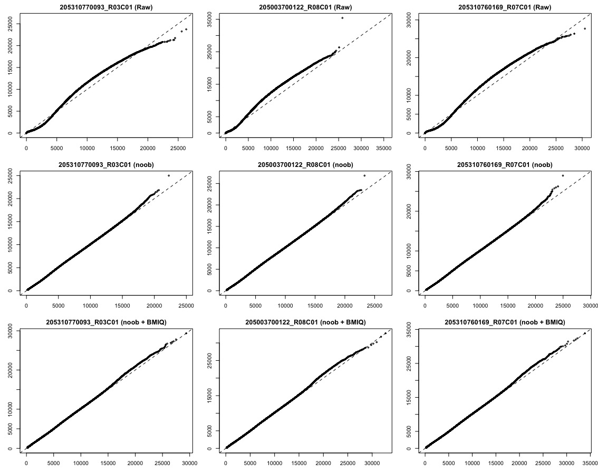
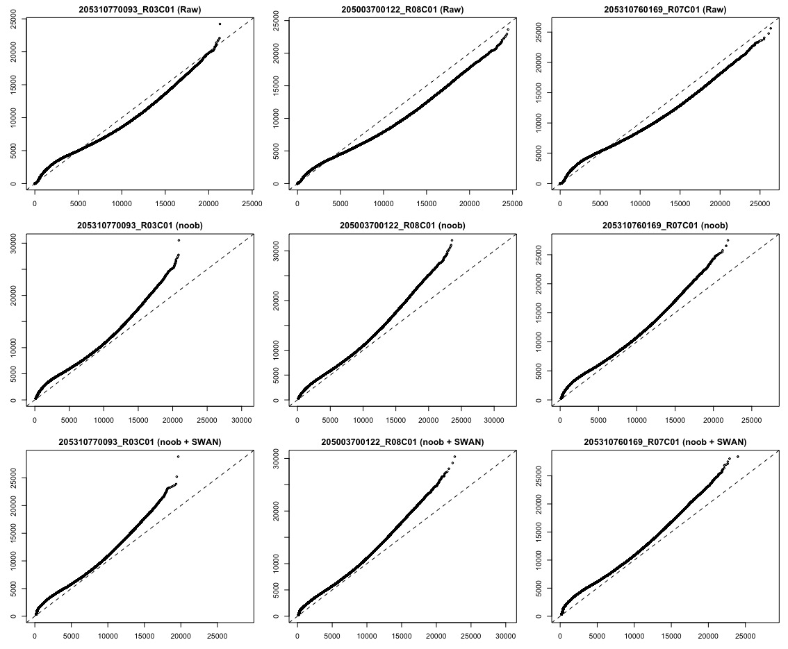
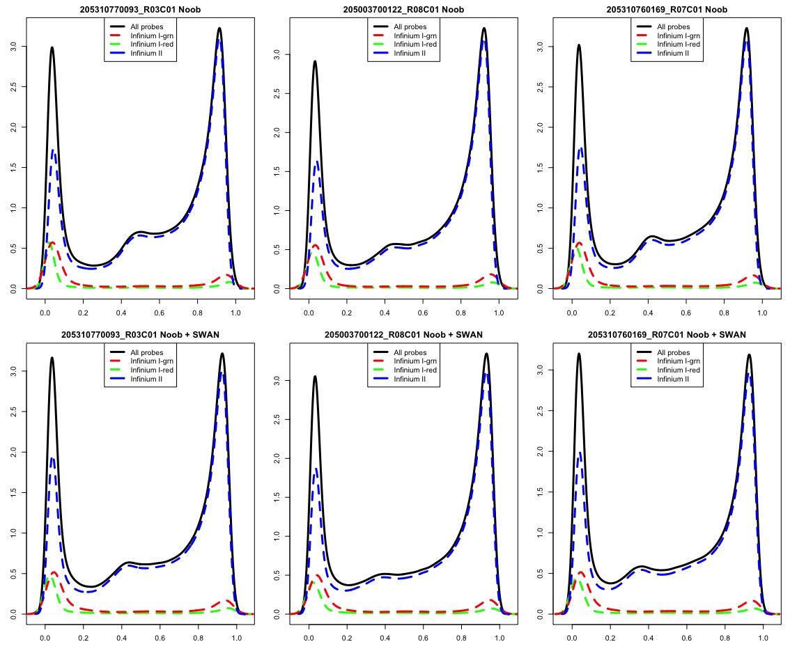

```{r, echo=FALSE, out.width='70%', fig.show='hold'}
logo <- system.file("figures", "sph_cida_wm_blk.png", package="CIDAtools")
knitr::include_graphics(logo)
```

------------------------------------------------------------------------

```{r setup, include=FALSE}
knitr::opts_chunk$set(echo = FALSE)
library(tidyverse)
library(knitr)
library(kableExtra)
library(sesame)
library(skewr)
library(minfi)
```

# Introduction

While completing normalization procedures for this project, implementation issues arose using the `sesame` pipeline as described by [@zhou2018]. The issues are as follows:  

1. Using only the 'noob' normalization protocol was not sufficiently aligning Type-I red/green and Type-II Infinium probes.
1. Using the 'noob + BMIQ' protocol gave a more desirable normalization for the beta values, but re-introduced substantial dye bias.

As a result of these issues, the `noob + SWAN` normalization procedure implemented in the package `minfi` was also explored as an option. The purpose of this report is to characterize those individual explorations and compare the results as a reference material for justification of the normalization procedure chosen. 

# Methods

The following normalization steps were taken for each scenario: 

## noob

$$qualityMask \rightarrow inferInfiniumIChannel \rightarrow dyeBiasNL \rightarrow pOOBAH \rightarrow noob$$  

## noob + BMIQ  

$$qualityMask \rightarrow inferInfiniumIChannel \rightarrow dyeBiasNL \rightarrow pOOBAH \rightarrow noob \rightarrow BMIQ$$  


## noob + BMIQ + dyeBiasNL

This method performs dye bias as the last step in the procedure instead of the middle step. 

$$qualityMask \rightarrow inferInfiniumIChannel \rightarrow pOOBAH \rightarrow noob \rightarrow BMIQ \rightarrow dyeBiasNL$$  

## noob + SWAN  

Since the 'noob + SWAN' procedure had to be implemented in `minfi`, the probes retained from the `sesame` pipeline annotated above were also used to maintain comparability across methods. `minfi`'s implementation of dye bias correction is not well documented and cannot be applied separately from NOOB, dye bias correction could not be moved in the process.

$$subsetByLoci \rightarrow dye \ bias \ correction \rightarrow noob \rightarrow SWAN$$

# Results

Each method will consist of two plots. One comparing dye bias after each normalization procedure and one comparing beta distribution by probe type after each normalization procedure. The results for the models that only use 'noob' can be seen in the 'noob + BMIQ' results section. 

## noob + BMIQ

### Dye Bias


The plots above show an evaluation of dye bias for a random subset of samples. An improvement in dye bias can be seen from the 'raw' data to the 'noob'-normalized data, but the addition of 'BMIQ' normalization re-introduces some dye-bias in all samples. 

### Beta Distribution by Probe Type  

The plots above show the distribution of beta-values for the same subset of samples. It can be seen that the 'noob + BMIQ' normalization does a better job of bringing Type-I and II probes into alignment.

## noob + BMIQ + dyeBiasNL  

In the plots presented below, dyeBiasNL has been moved to the **end** of the normalization process.  

### Dye Bias


In comparison with the dye-bias plots from "noob + BMIQ", it can be seen that the dye-bias present in each sample at the "noob + BMIQ" procedure is substantially less.  

### Beta Distribution by Probe Type  

In comparison with the distribution plots of beta-values in "noob + BMIQ", it appears that the distribution still has good alignment among the different probe types; however, the is some additional noise in the Infinium I - Grn probes around a beta value of 0.7. 

## noob + SWAN
### Dye Bias  


In comparison to the "noob + BMIQ" and "noob + BMIQ + dyeBiasNL" results, dye bias is visually worse for all samples after both noob and noob + SWAN normalization. 

### Beta Distribution by Probe Type  


In comparison to the "noob + BMIQ" and "noob + BMIQ + dyeBiasNL" results, the distributions for the beta values have similar alignment, but less red and green probes in comparison to the `sesame` pipeline.  

# Conclusions

In comparing normalization methods, the methods surrounding "noob + BMIQ" normalization appear to have lower dye bias and better alignment among the beta distributions of the varying probe types. It also seems that there is a trade-off between dye bias and beta distribution alignment among the different probe types. Moving the dye bias correction step to the end of "noob + BMIQ" normalization produced less dye bias, but may add some noise to the beta distribution for the Type I-green probes. The noise added, however, is small. This analysis will proceed with the "noob + BMIQ + dyeBiasNL" normalization method. 

# Session Info
```{r}
sessionInfo()
```

# References
::: {#refs}
:::

<!-- footer -->

------------------------------------------------------------------------

```{r, echo=FALSE, out.width='70%', fig.show='hold'}
knitr::include_graphics(logo)
```
