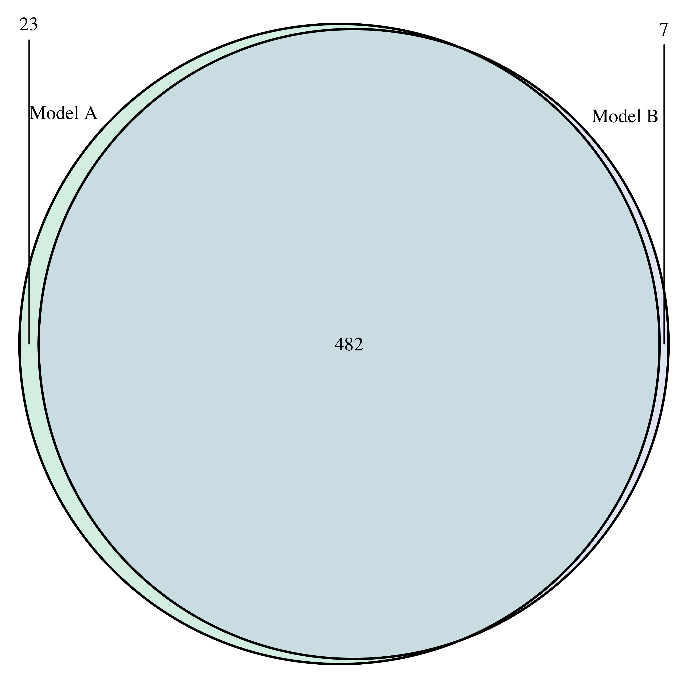

```{r, echo=FALSE, out.width='70%', fig.show='hold'}
logo <- system.file("figures", "sph_cida_wm_blk.png", package="CIDAtools")
knitr::include_graphics(logo)
```

------------------------------------------------------------------------

```{r setup, include=FALSE}
knitr::opts_chunk$set(echo = TRUE, message = F, warning = F, error = F)
library(ggpubr)
library(tidyverse)
library(knitr)
library(kableExtra)
library(DESeq2)
library(here)
library(RColorBrewer)
library(VennDiagram)


#############Table Version of Venn Diagram##################
kablize <- function(tab, digits = 3) {
  kable(tab,digits = digits, booktabs = T) %>% 
  kableExtra::kable_styling(latex_options = c("hold_position", "striped"), position = "center")
}

format_num <- function(number, digits = 0) {
  formatC(number, digits = digits, format = "f", big.mark = ",")
}
```

# Introduction

In the generalized results report, Sample 12 may not have been sufficiently corrected by the DESeq2 model as suggested by the RLE and PCA plots produced by RUVSeq (see "Exploratory Report" and "Differential Expression Results"). This short report will perform a sensitivity analysis for Sample 12 and compare the results for the *Vape Status* model with results when Sample 12 is removed from the model. It will conclude by deciding whether to keep sample 12 for future analyses.

# Methods

To assess the difference in model outputs, the following model was fit in DESeq2 ver. `r package.version("DESeq2")` both with and without Sample 12. Likelihood Ratio Tests (LRTs) were implemented to test for gene significance and corrected with FDR $\le$ 0.05. The model containing Sample 12 will be referred to as *Model A* and the model with sample 12 removed will be referred to as *Model B*.

$$Full \ Model \\ raw \ read \ count \sim vape \ status + recruitment \ center + sex + age + ruv_1 + ruv_2$$

$$Reduced \ Model \ (Vape \ Status) \\ raw \ read \ count \sim recruitment \ center + sex + age + ruv_1 + ruv_2$$\

To assess the difference in the models, the results will focus on genes with relatively low variability. To achieve a stable subset, a cutoff value for \|Log~2~(Fold-Change)\| will be selected through visual inspection, and then the top 100 genes will be subset from Model A. Some visualizations that will help analyze the relationship of excluding sample 12 are:\
<br/>

1.  A summary of significant genes in each model.\
    <br/>
2.  Visualizations comparing \|Log~2~(Fold-Change)\| estimates between the two models.\
    <br/>
3.  A short table for the top 10 genes and their estimates in both models.\
    <br/>
4.  Boxplots of some of the top genes to demonstrate the effect that sample 12 has on the estimate.

<br/>

To help visualize the overall trend, some of these visualizations will be repeated for a larger subset (2000) of the genes.

# Results

The top 100 genes determined by the FDR-adjusted p-value were subset from Model A to compare to Model B. This comparison shows that the top 100 genes in Model A are identical to the top 100 genes in Model B. Some of these genes have very small estimates, which may lead to an extremely large % change, even if the actual amount of change is relatively small. To find a more stable subset of genes, Figure 1 presents a range of possible cutoff values and how those cutoff values change the composition of significant genes (overall and in the top 100).

```{r fig.width=12}
#############Read in results###################
modA_res <- read_csv(here("DataProcessed/rna_seq/differential_expression/full_analysis/full_vape_res_2022_10_13.csv"))
modB_res <- read_csv(here("DataProcessed/rna_seq/differential_expression/sample12_sensitivity/Vape_Results_no12_2022_10_11.csv"))

#############Join results and get top 100 genes###################
AB_res <- left_join(modA_res, modB_res, by = c("ensg", "gene_name", "gene_type"), suffix = c(".modA", ".modB"))

#no cutoff
top_100_genes_AB <- AB_res %>% arrange(padj.modA) %>% .[1:100,]

######################### Filter for log-fold change (check) ###############################

check_lf_cutoff <- function(de_res) {
  top_100 <- de_res %>% arrange(padj) %>% .[1:100,]
  cutoff_seq <- seq(0,6,0.25)
  cutoff_res <- NULL
  top_100_res <- NULL
  for (cutoff in cutoff_seq) {
    #How does it change all of the genes?
    num_genes <- nrow(de_res %>%
                        filter(padj < 0.05) %>% 
                        filter(abs(log2FoldChange) > cutoff))
    cutoff_res <- append(cutoff_res, num_genes)
    
    #How does it change the top 100 genes?
    top_100_change <- 100 - nrow(top_100 %>% 
                        filter(abs(log2FoldChange) > cutoff))
    
    top_100_res <- append(top_100_res, top_100_change)}
  
  result <- tibble(Cutoff = cutoff_seq,
                   Genes = cutoff_res,
                   Genes_100 = top_100_res)
  return(result)
}

sample_12_cutoff <- check_lf_cutoff(modA_res)

allgenes_cutoff <- sample_12_cutoff %>% 
  ggplot(aes(x = Cutoff, y = Genes)) +
  geom_point() +
  geom_line() + geom_vline(xintercept = 2, col = 'red', linetype = 2) +
  scale_x_continuous(breaks = seq(0,6,1)) +
  labs(y = "Significant Genes Remaining",
       title = "Genes Removed (All Genes)")

top_100_cutoff <- sample_12_cutoff %>% 
  ggplot(aes(x = Cutoff, y = Genes_100)) +
  geom_point() +
  geom_line() +
  geom_vline(xintercept = 2, linetype = 2, col = 'red') +
  scale_x_continuous(breaks = seq(0,6,1)) +
  labs(y = "Genes Changed",
       title = "Genes Changed (Top 100)")

ggarrange(allgenes_cutoff, top_100_cutoff, nrow = 1, ncol = 2)

```

Figure 1 shows A) the number of genes removed from all significant genes in Model A and B) the number of genes that change in the subset of the top 100 genes. It should be noted that those genes are still significant, but not included in the range of the cutoff demonstrated. We will use a cutoff of \|Log~2~(Fold-Change)\| \> 2. At this cutoff value, `r format_num(as.numeric(sample_12_cutoff[9,2]), 0)` genes remain in the overall results from Model A, and `r format_num(as.numeric(sample_12_cutoff[9,3]), 0)` genes changed in the composition of the top 100 genes. These plots tell us that the majority of the top 100 genes had a small \|Log~2~(Fold-Change)\|.

```{r}
#implement cutoff
AB_res_cutoff <- AB_res %>% 
  filter(abs(log2FoldChange.modA) > 2) %>% 
  arrange(padj.modA) %>% 
  dplyr::rename(Gene = ensg,
                Gene_Name = gene_name,
                Gene_Type = gene_type,
                Estimate_A = log2FoldChange.modA,
                Estimate_B = log2FoldChange.modB,
                FDR_A = padj.modA,
                FDR_B = padj.modB)

#Get the top 100 genes
cutoff_100 <- AB_res_cutoff[1:100,]

#number of genes included both before and after cutoff implemented
genes_kept <- as.numeric(sum(top_100_genes_AB$ensg %in% cutoff_100$ensg))

#genes changed
genes_changed <- 100 - genes_kept

#Make Tidy Results
cutoff_100_res <- cutoff_100 %>% 
  dplyr::mutate(fold_change_diff = Estimate_B - Estimate_A,
                fold_change_diff_p = (Estimate_B - Estimate_A)/Estimate_A) %>% 
  dplyr::select(Gene, Gene_Name, Gene_Type, Estimate_A, Estimate_B, fold_change_diff, fold_change_diff_p, FDR_A, FDR_B) %>% 
  dplyr::rename("Ensembl Gene ID" = Gene,
                "Gene Name" = Gene_Name,
                "Gene Type" = Gene_Type,
                "Estimate Diff"= fold_change_diff,
                "% Diff" = fold_change_diff_p)


#############Venn Diagram##################
#Get significant pvals
pval_match <- AB_res %>%
  dplyr::mutate(modA_sig = if_else(padj.modA < 0.05 & padj.modB > 0.05, T,F),
                modB_sig = if_else(padj.modB < 0.05 & padj.modA > 0.05, T,F),
                modAB_sig = if_else(padj.modB < 0.05 & padj.modA < 0.05, T,F),
                neither_sig = if_else(padj.modA > 0.05 & padj.modB > 0.05,T, F)) %>%
  dplyr::arrange(padj.modA)

cutoff_100 <- pval_match[1:100,]

#Get significant gene names for each model
modA_sig_genes <- pval_match[pval_match$padj.modA < 0.05,]$gene_name
modB_sig_genes <- pval_match[pval_match$padj.modB < 0.05,]$gene_name

#Set color palatte
venn_color <- brewer.pal(3,"Pastel2")

#Make Venn Diagram
# VennDiagram::venn.diagram(x = list(modA_sig_genes,modB_sig_genes),
#                           category.names = c("Model A","Model B"),
#                           filename = here("Reports/de_sampe12_sensitivity/images/sample12_sens_venn_2022_10_21.png"),
#                           lwd = 2,
#                           fill = c(venn_color[1],venn_color[3]))
```

### Figure 2: Total Significant Genes in Models A & B

The top 100 significant genes in models A & B are identical both before and after the selected cutoff value (\|Log~2~(Fold-Change)\| \> 2). A Venn Diagram of these would be trivial (a single circle), so Figure 2 shows the breakdown of the significant genes in Models A and B.One feature that is not yet well understood is that there are a large number of significant genes in both models, but applying the cutoff value results in a reasonable number of genes (505).

{width="5in"}

### Figure 3: Difference in Log~2~(Fold-Change) (Top 100 Genes)

Figure 3 displays A) Log~2~(Fold-Change) from each model plotted against each other; B & C) histograms of the difference in Log~2~(Fold-Change) estimates by subtracting the estimate of Model B from the estimate from Model A.

```{r fig.height=8, fig.width=10}
#############Plots of change in log2fc##################
#Scatter Plot
change_scatter <- cutoff_100_res %>% 
  ggplot(aes(x = Estimate_A, y = Estimate_B)) +
  geom_point(col = case_when(cutoff_100_res$Estimate_A > 0 & cutoff_100_res$Estimate_B < 0 ~ 'red',
                             cutoff_100_res$Estimate_A < 0 & cutoff_100_res$Estimate_B > 0 ~ 'red',
                             TRUE ~ 'black')) +
  geom_abline(intercept = 0, slope = 1, linetype = 2, col = 'red')+
  labs(x = "Log2(FC) (Model A)",
       y = "Log2(FC) (Model B)",
       title = "A")

#Histogram of difference
diff_hist <- cutoff_100_res %>% 
  ggplot(aes(x = `Estimate Diff`)) +
  geom_histogram(col = 'white', binwidth = 0.25) +
  scale_x_continuous(breaks = seq(-1.5, 1.5, 0.5)) +
  geom_vline(xintercept = 0, linetype = 2, col = 'red') +
  labs(x = "Difference Log2(FC)",
       y = "Count",
       title = "B")

#Histogram of % change
p_diff_hist <- cutoff_100_res %>% 
  ggplot(aes(x = `% Diff`*100)) +
  geom_histogram(col = 'white', binwidth = 10) +
  scale_x_continuous(breaks = seq(-100, 100, 25)) +
  geom_vline(xintercept = 0, linetype = 2, col = 'red') +
  labs(x = "Difference (%)",
       y = "Count",
       title = "C")

ggarrange(change_scatter, ggarrange(diff_hist, p_diff_hist, ncol = 2, nrow = 1, legend = "none"), nrow = 2, common.legend = T, legend = "bottom")
```

*Table 1: Top 10 Significant Genes Models A & B*

```{r}
cutoff_100_res$`Ensembl Gene ID` <- gsub("\\..*","",cutoff_100_res$`Ensembl Gene ID`)

cutoff_100_res[1:10,] %>% 
  mutate(`% Diff` = `% Diff`*100) %>% 
  select(`Ensembl Gene ID`, `Gene Name`, `Gene Type`, Estimate_A, Estimate_B, `Estimate Diff`, `% Diff`, FDR_A, FDR_B) %>% 
  mutate(FDR_A = if_else(FDR_A < 0.001, "< 0.001", as.character(round(FDR_A,3))),
         FDR_B = if_else(FDR_B < 0.001, "< 0.001", as.character(round(FDR_B,3)))) %>% 
  dplyr::rename("Log~2~(FC) (Mod A)" = Estimate_A,
                "Log~2~(FC) (Mod B)" = Estimate_B,
                "Log~2~(FC) Difference (B - A)" = `Estimate Diff`,
                "Log~2~(FC) Difference (%)" = `% Diff`,
                "FDR (Mod A)" = FDR_A,
                "FDR (Mod B)" = FDR_B) %>% 
  kablize(.,digits = 3)
```

These results demonstrate that excluding sample 12 from the model inflates estimates of \|Log~2~(Fold-Change)\|; however, it does not significantly change the composition of significant genes or the associated p-values. The |Log~2~(Fold-Change)| do not switch directions, either.

### Figure 4: Difference in Log~2~(Fold-Change) (Top 2000 Genes)

Figure 4 parallels Plot A in Figure 3, but includes the top 2000 genes to visualize the overall trend.

```{r}
#Get the top 2000 genes
top_2000 <- AB_res[1:2000,]

#Make Tidy Results
top_2000_res <- top_2000 %>% 
  dplyr::mutate(fold_change_diff = log2FoldChange.modB - log2FoldChange.modA,
                fold_change_diff_p = (log2FoldChange.modB - log2FoldChange.modA)/log2FoldChange.modA) %>% 
  dplyr::select(ensg, gene_name, gene_type, log2FoldChange.modA, log2FoldChange.modB, fold_change_diff, fold_change_diff_p, padj.modA, padj.modB) %>% 
  dplyr::rename(Gene = ensg,
                Gene_Name = gene_name,
                Gene_Type = gene_type,
                Estimate_A = log2FoldChange.modA,
                Estimate_B = log2FoldChange.modB,
                Estimate_Difference = fold_change_diff,
                FDR_A = padj.modA,
                FDR_B = padj.modB)

#Scatter Plot
change_scatter <- top_2000_res %>% 
  ggplot(aes(x = Estimate_A, y = Estimate_B)) +
  geom_point() +
  geom_abline(aes(intercept = 0, slope = 1, col = "A = B"), linetype = 2)+
  labs(x = "Log2(FC) (Model A)",
       y = "Log2(FC) (Model B)",
       title = "A")+
  scale_x_continuous(breaks = seq(-10,10,2)) +
  scale_y_continuous(breaks = seq(-10,10,2)) +
  scale_color_manual(name = "Guides", values = c("A = B" = "red"))
change_scatter
```

Figure 4 shows a similar pattern to figure 3. Estimates are inflated, but do not deviate widely from the line representing equal estimates in the two models (A = B).

### Figure 5: -log~10~(p-value) Model A vs. Model B

Figure 5 similarly visualizes the trend by plotting -log~10~(p-value) for each of the models plotted against each other.

```{r}
top_2000 %>% 
  ggplot(aes(x = -log10(padj.modA), y = -log10(padj.modB))) +
  geom_point() +
  geom_abline(intercept = 0, slope = 1, linetype = 2, col = 'red') +
  labs(x = "-log10(p-value A)",
       y = "-log10(p-value B)")
```

Excluding sample 12 from the model additionally inflates p-values. P-values are already very small, so smaller p-values do not necessarily change the overall composition of significant genes.

### Figure 6: Boxplots of Top Genes (RUVr-Normalized Counts)

```{r fig.height=6, fig.width=8}
full_ruv_tidy <- read_csv(here("DataProcessed/rna_seq/differential_expression/full_analysis/vape_ruv_normcounts_2022_10_13.csv"))

top_4 <- unique(full_ruv_tidy$symbol)[1:4]

full_ruv_tidy <- full_ruv_tidy %>% 
  filter(symbol %in% top_4)

ruv_tidy_no12 <- read_csv(here("DataProcessed/rna_seq/differential_expression/sample12_sensitivity/RUV_Vape_Results_no12_2022_06_14.csv"))

ruv_tidy_no12 <- ruv_tidy_no12 %>% 
  filter(ruv_tidy_no12$gene %in% full_ruv_tidy$gene)

#Results Boxplots (Vape and Center, Vape Only, Center Only)
tcount_boxplot <- function(tcounts, title) {
  vape_colors <- brewer.pal(3,"Set2")
  #Stratified by vape status only
  vape_box <- tcounts %>% 
    ggplot(aes(vape_6mo_lab, expression, fill= vape_6mo_lab)) + 
    geom_boxplot() + 
    geom_text(label = if_else(tcounts$Row.names == "Sample12", tcounts$Row.names, ""), col = "Red") +
    labs(x="", 
         y="Expression (log(ruv-normalized counts)", 
         fill = "Vape Status (6 mo)", 
         title= title) +
    scale_fill_manual(values = vape_colors) +
    facet_wrap(~symbol, scales="free_y") +
    theme(axis.text.x = element_blank(),
          axis.ticks.x = element_blank(),
          legend.position = "bottom")
  
  return(vape_box)
}

full_boxplots <- tcount_boxplot(full_ruv_tidy, "Model A")
no12_boxplots <- tcount_boxplot(ruv_tidy_no12, "Model B")

ggarrange(full_boxplots, no12_boxplots, nrow = 1, ncol = 2, common.legend = T, legend = "bottom")
```

Figure 6 demonstrates that estimates of expression for Sample 12 are consistently low. Thus, the patterns seen in figures 4 and 5 are consistent with boxplots for gene expression.

# Conclusion

When looking at only the top 100 genes as determined by FDR, all genes retain significance from Model A to Model B. From the series of visualizations presented in the report, excluding sample 12 inflates \|Log~2~(Fold-Change)\| estimates, but does not significantly change the composition of significantly expressed genes. Looking at at a larger subset of the top genes confirms that estimates are inflated overall when excluding sample 12. Since excluding the sample does not change the composition or direction of Log~2~(Fold-Change) estimates, sample 12 will be included in further analyses.

<!-- footer -->

------------------------------------------------------------------------

```{r, echo=FALSE, out.width='70%', fig.show='hold'}
knitr::include_graphics(logo)
```
